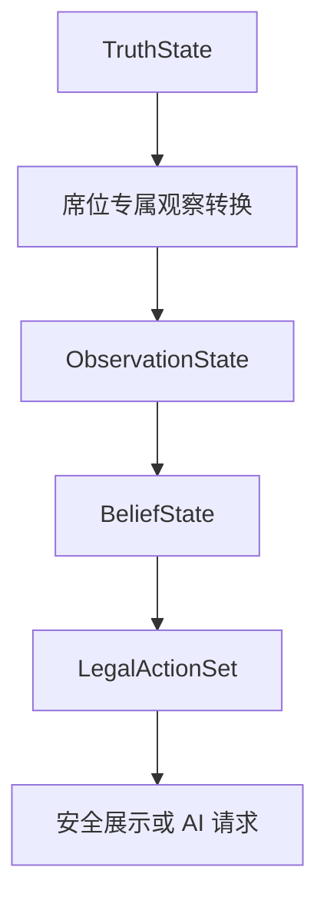

# 信息边界

## 五层状态

| 层 | 所有者 | 可包含内容 | 不得包含 |
|---|---|---|---|
| `TruthState` | 服务端领域核心 | 真实物品、损坏、布局、价值、鉴定结果 | 席位推断 |
| `ObservationState` | 单一席位 | 该席位合法获得的证据 | 其他席位私有观察、未观察真相 |
| `BeliefState` | 单一席位 | 估计、概率、风险、置信度 | 权威真相 |
| `DecisionState` | 服务端流程 | 当前合法动作、锁定决定 | 非法动作、任意资金修改 |
| `PresentationState` | 客户端/叙述器 | 经过裁剪的公共与席位私有展示 | 原始真相对象 |

## 安全视图

### `PlayerSeatView`

包含公共状态、玩家自己的观察、信念、估值、资金和合法动作。

### `AISeatView`

与玩家遵守相同信息原则，但可加入该角色的策略参数。每个 AI 席位单独构造，不复用其他席位上下文。

### `PublicAuctionView`

只包含公开出价、当前领先席位、合法竞拍阶段和公开台词。

### `NarratorView`

只包含当前允许叙述的信息。对于不该透露的隐藏事实，正确做法是完全省略字段，而不是传入后再要求模型“不要说”。

## 数据流

## 不变量

1. 客户端响应中不存在 `TruthState` 序列化。
2. 任一席位视图都无法推出其他席位的私有观察。
3. 模型输入不包含未授权隐藏事实。
4. 合法动作由服务端生成，客户端和模型只提交动作 ID。
5. 台词不会改变规则状态。
6. 日志不保存能重建隐藏真相的完整请求正文。

## 测试要求

- 为每种安全视图做 schema 快照测试。
- 用禁止字段列表扫描 API 和 AI 请求。
- 构造两个不同席位，断言其私有观察不能交叉。
- 对叙述器测试“字段缺失”，而不是测试提示词是否承诺保密。

