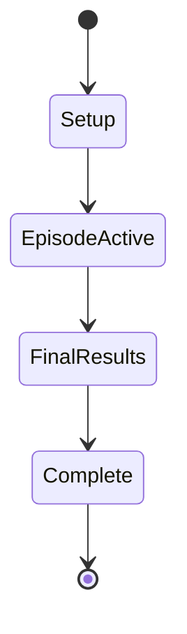
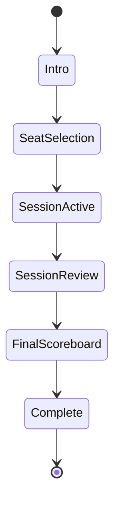
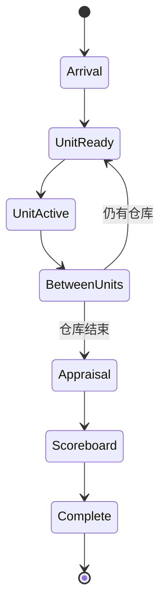
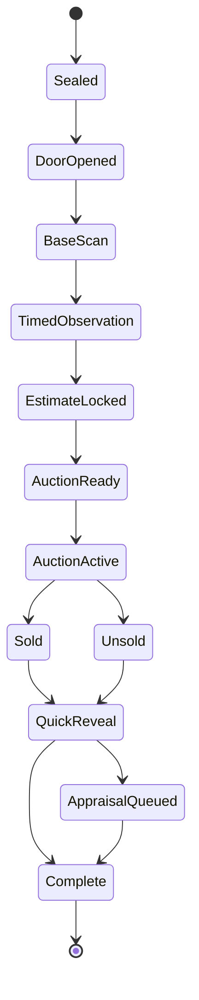
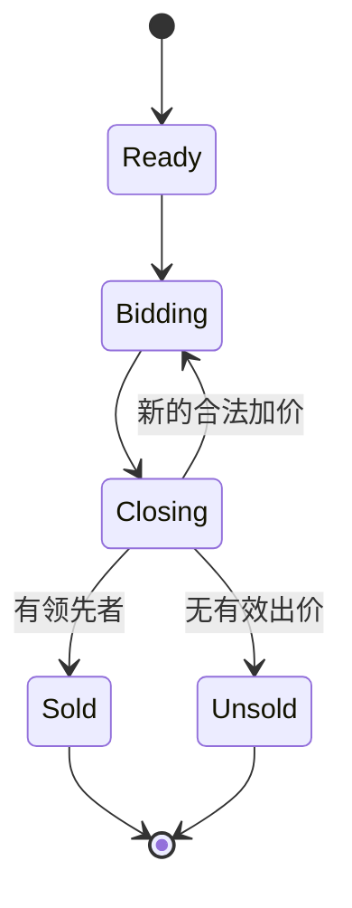

# 状态机

## 游戏

## Episode

## AuctionSession

## StorageUnit

## Auction

## 转换规则

- 每个命令必须声明期望状态；状态不符时拒绝，不隐式修复。
- 每次有效转换产生不可变领域事件。
- 倒计时只影响 `TimedObservation` 的可接受命令窗口。
- 模型调用不是领域状态；模型超时通过回退动作继续当前合法转换。
- 成交与扣款必须在同一应用事务中完成。
- 重放事件时不得再次调用模型或读取墙上时钟。

