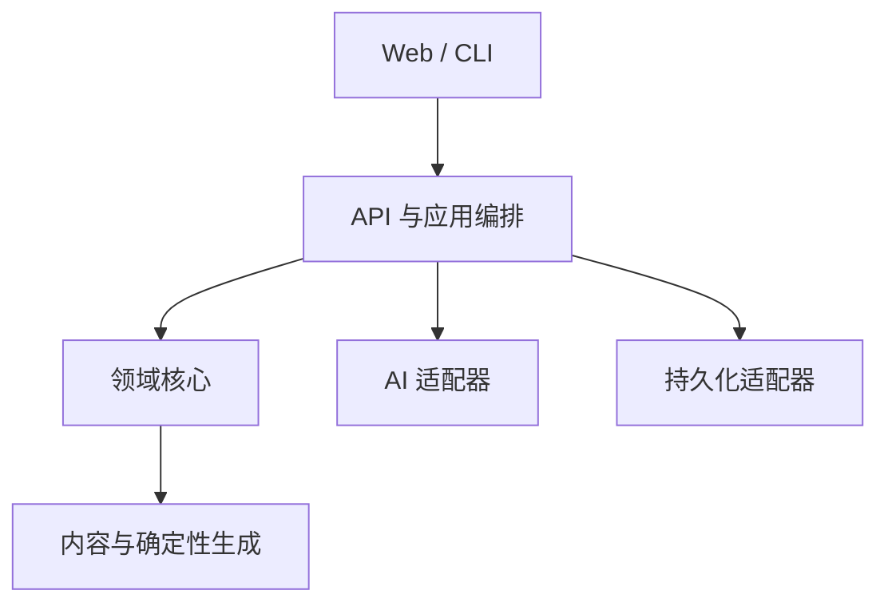
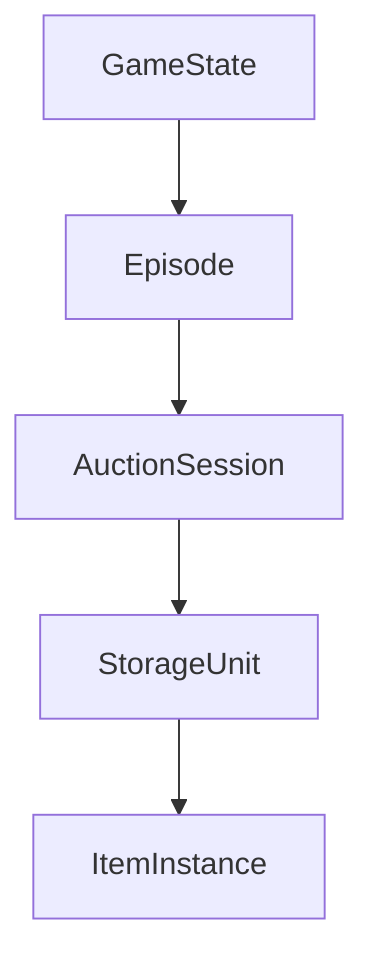

# 系统架构

## 目标

架构优先保证规则确定性、信息隔离、故障回退和可测试性。P0 使用模块化单体，不拆微服务。

## 层次



### 领域核心

不依赖 FastAPI、React 或 DeepSeek SDK，包含：

- 仓库真相与安全视图
- 观察和席位信念
- 估值快照
- 拍卖状态机与合法动作
- 揭晓、鉴定、评分和账本

### 应用编排

负责推进 Episode、Session 和 StorageUnit，调用领域命令并发布领域事件。它不复制领域规则。

### 适配器

- AI：DeepSeek 与规则 AI。
- 持久化：保存、加载、回放。
- API：把安全视图和合法命令暴露给客户端。
- Web/CLI：接收用户意图并展示结果。

## 领域层级



## 关键模型

### 静态内容

- `Character`
- `ItemDefinition`
- `StorageUnitTemplate`
- `ContentPack`

### 运行时状态

- `Seat`
- `ItemInstance`
- `ItemPresentationGroup`
- `ObservationRecord`
- `BeliefState`
- `EstimateSnapshot`
- `AuctionState`
- `LegalActionSet`
- `AuctionEvent`
- `Ledger`
- `ScoreboardEntry`

## 依赖注入边界

为保证测试和回放，以下能力不得被领域代码直接实例化：

- `RandomSource`
- `Clock`
- `IdFactory`
- `AIProvider`

## 推荐的后续目录

Task 1 后再逐步创建，避免阶段一出现空代码结构：

```text
src/storage_auction/
  domain/
  application/
  content/
  adapters/
  api/
tests/
  unit/
  contract/
  integration/
  simulation/
web/
tools/
data/
```

## 边界规则

- 内容加载后先做 schema 与语义校验，再进入生成器。
- 生成器只输出真相，不生成席位观察。
- 观察服务把真相转换为某席位可见证据。
- 估值服务只读取该席位的证据和允许的角色能力。
- 拍卖服务只读取公开竞拍状态、席位资金与合法命令。
- 叙述器读取专用 `NarratorView`，不能读取完整真相对象。

