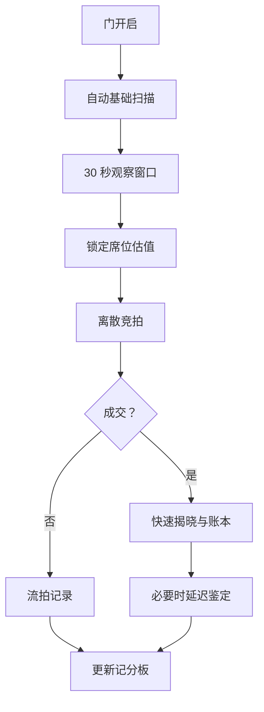

# 核心游戏循环

## 局、场次与仓库

- `GameState`：一次完整游戏。
- `Episode`：一个节目式章节，包含角色选择和最终结算。
- `AuctionSession`：同一地点的一组仓库拍卖。
- `StorageUnit`：一次观察、估值、竞拍和揭晓的最小玩法单元。

P0 可先用一个 Episode、一个 Session 和少量 StorageUnit 实现垂直切片，但领域层保留完整层级。

## 单仓库循环

## 观察

- 自动扫描不消耗重点观察次数。
- 重点观察只能选择服务端提供的目标与动作。
- 倒计时属于玩家决策压力，不因模型网络延迟而减少。
- 倒计时结束或 2 次重点观察用尽后，进入估值锁定。
- 观察结果追加到该席位的 `ObservationState`，不得修改 `TruthState`。

## 估值

每个席位基于自己的观察和角色能力形成：

- 低位估计
- 中位估计
- 高位估计
- 置信度
- 主要风险标签

估值是席位信念，不是隐藏真相。竞拍前一旦锁定，后续只能创建新的快照，不能覆盖历史记录。

## 竞拍

- 服务端计算当前合法动作，例如放弃、跟价、按离散档位加价。
- 玩家点击动作；AI 选择动作 ID。
- 服务端校验资金、最小增量、席位状态和拍卖阶段。
- 成交后通过账本扣款；客户端或 AI 不能直接改余额。

## 揭晓与反馈

- 快速揭晓提供立即可确认的信息。
- 延迟鉴定用于需要专家判断或测试的少量物品。
- `show_profit` 表达节目中基于鉴定值的纸面结果。
- `realized_profit` 只在实际出售并产生净现金后成立。
- 反馈要帮助玩家学习观察与估价，不以事后篡改制造戏剧性。

